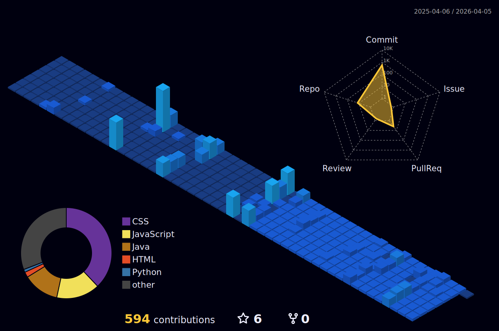

<h1 align="center" style="color:#367BF0;">Hi! I'm Sharick G. Pinto</h1>

Software Developer • Learning by doing

  

  

  

> 💼 **I'm open to receiving offers for jobs**

---

### 📬 Connect with me:

  

  📧 <a href="mailto:pinto702rodri@gmail.com"><b>pinto702rodri@gmail.com</b></a> 
  📱 <b style="color:#9B59B6;">+57 3187117103</b>

> 📣 **You can contact me more easily via LinkedIn or Email.**

---

### 🧠 Skills

<table align="center" cellpadding="10">
  <tr>
    <th align="left">🌐 Front-End</th>
    <td align="center">
      
      
      
    </td>
  </tr>
  <tr>
    <th align="left">💻 Back-End / Logic</th>
    <td align="center">
      
    </td>
  </tr>
  <tr>
    <th align="left">💾 Databases</th>
    <td align="center">
      
      
    </td>
  </tr>
  <tr>
    <th align="left">🧠 Methodologies & VCS</th>
    <td align="center">
      
      
      
    </td>
  </tr>
  <tr>
    <th align="left">🎨 Design</th>
    <td align="center">
      
    </td>
  </tr>
</table>

---

  

  

  

