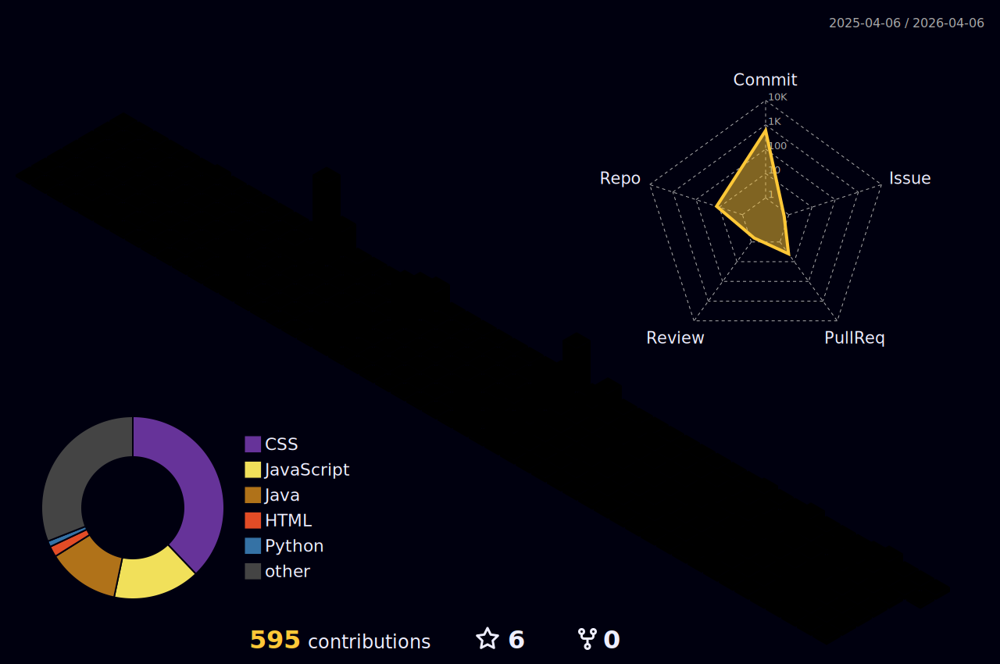

<!-- Header -->
<h1 align="center">👋 Hola, soy SharickGPinto</h1>
<h3 align="center">Desarrollador en formación | Python & Web | Git & Scrum</h3>

  

---

## 🏆 Trofeos
<!-- Recurso: https://github.com/ryo-ma/github-profile-trophy -->

  

---

## 🧊 Actividad 3D
<!-- Recurso: https://github.com/yoshi389111/github-profile-3d-contrib -->
<!-- Esto muestra el SVG generado por la acción. Si configuras el repo como en el README del proyecto, solo apuntas a tu archivo -->

  

---

## 👤 Sobre mí
- 🔁 Manejo de **(Scrum)** para organizar el trabajo.
- 🐍 Trabajo con **Python** para scripts y ejercicios.
- 🌐 Desarrollo básico con **HTML, CSS y JavaScript**.
- 🗄️ Manejo de bases de datos: **MySQL** y **MongoDB**.
- 🧪 Me gusta versionar todo con **Git/GitHub**.
- 📚 Sigo aprendiendo y subiendo proyectos prácticos.

---

## 🛠 Tecnologías

  
  
  
  
  
  
  
  
  

---

## 📂 Qué encontrarás aquí
- Ejercicios y proyectos en **Python**.
- Prácticas de **HTML/CSS/JS**.
- Modelos y pruebas con **MySQL/MongoDB**.
- Repos con ejemplos de **Git** y flujo de trabajo.
- Cosas que voy subiendo mientras estudio 👀

---

## 📊 Stats

  

  

---

## 📫 Contacto
- 📧 correo: tu-correo@example.com
- 💼 (opcional) LinkedIn / portafolio

---

<!-- Nota para ti:
1. Crea un repo llamado EXACTAMENTE como tu usuario: TU-USUARIO
2. Mete este README.md ahí.
3. Para que el 3D se vea, sigue las instrucciones del repo de yoshi389111 (es una GitHub Action que genera el SVG).
-->
